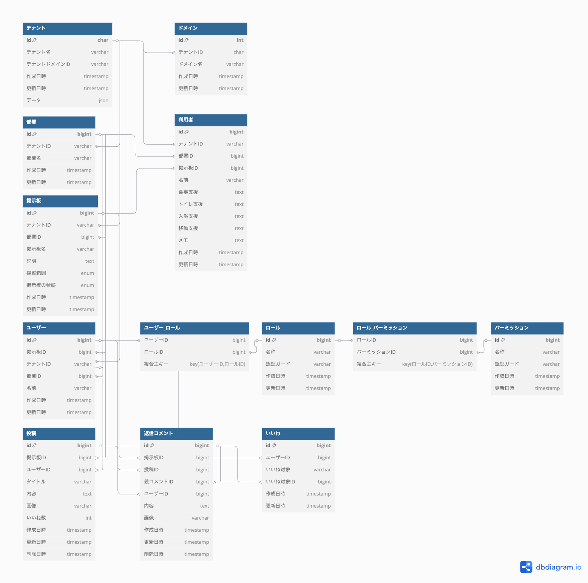

# CommuniCare

## どのようなサービスなのか？

**職員の効率的なコミュニケーションと情報管理を支援**

CommuniCare は、介護施設の運営を効率化するために、職員間のスムーズなコミュニケーションと利用者様の情報を一元管理するプラットフォームです。


---

## サービスの URL

[https://communi-care.jp](https://communi-care.jp/)

ゲストデモ機能を実装しましたので、登録せずにお試しいただくことも可能です。

---

## サービスを開発した背景

### **職員間の連携を強化する、タイムリーな情報共有**

介護現場では、情報共有の遅れや漏れが利用者のケアに直接影響します。この課題を解決するため、 **「誰でも直感的に使える 介護施設向けの情報共有ツール」** として CommuniCare を開発しました。

-   **課題:** 口頭での申し送りや手書きノートによる情報共有が主流で、必要な情報を得るには現場まで足を運ぶ必要がある。
-   **解決策:** どこにいても必要な情報を確認できるように、全体連絡と部署内連絡の両方に対応したツールを開発。
-   **こだわり:** 過去の重要なルールや情報を引用投稿機能で再共有することで、形骸化したルールの再確認も促進。

---

## 主な機能

-   **掲示板機能:** 全体連絡や部署間での申し送りなどのやり取りが可能。メイン機能として活躍。
-   **職員ページ機能:** 職員情報（名前、電話番号、メールアドレス）を表示し、部署ごとの一覧表示も可能。管理者は職員の登録・削除が可能。
-   **利用者ページ機能:** 利用者の基本情報、サービス内容、支援状況、備考などを表示・編集。管理者は利用者の登録・削除が可能。
-   **管理ページ:** ログイン中のユーザー情報とログイン状態を表示。管理者は部署管理（新規登録・削除）が可能。

_(スクリーンショットを適宜挿入)_

---

## マルチテナンシーの採用

CommuniCare は、**介護事業所ごとの独立した情報管理を可能にするマルチテナンシー構成**を採用しています。これにより、事業所ごとの機密情報を守りつつ、安全かつ効率的にサービスを提供できます。

### **1. マルチテナンシーの方式**

-   **データベースの分離方法:** シングルデータベース＋テナント識別

-   **テナントの識別方法:** `tenant_id` カラムを用いた識別に加え、サブドメインをレンタルサーバー側に登録。

    -   ホスト側でドメインとテナントを管理することで、各事業所に専用のサブドメインを発行。
    -   発行された URL にアクセスすることで、以降は専用の管理画面からサービスを利用可能。

※当初、マルチデータベース方式を採用していましたが、レンタルサーバーの制約によりデータベースの動的作成ができないため、シングルデータベース方式に変更しました。一方で、Docker 環境では動的なデータベース作成が可能であるため、ローカル開発環境ではマルチデータベース構成のテストも実施可能です。

### **2. マルチテナンシーを採用した目的**

-   **機密情報の保護:** 介護事業所ごとに独立したデータ管理を実現し、事業所間の情報漏洩を防止。
-   **専用の管理ページ:** 介護事業所ごとに専用の URL（ドメイン）を発行し、独自の管理ページを作成可能。

### **参考ドキュメント**

-   [Tenancy for Laravel 公式ドキュメント](https://tenancyforlaravel.com/)

### **参考動画（非公式）**

-   [01 What’s Inside the Course（YouTube）](https://www.youtube.com/watch?v=hDaVMqj5D5A&list=PLoT0Ngy3KoLLomJDbNhIrQRT3n0UHVxqQ)  
    _Yin Yin Kyaw 氏によるマルチテナンシーの概要解説（非公式）_

---

## 主な使用技術

| カテゴリ       | 技術                 | バージョン |
| -------------- | -------------------- | ---------- |
| フロントエンド | Vue.js, Tailwind CSS | 3.x        |
| バックエンド   | Node.js, Laravel     | 最新       |
| データベース   | MySQL                | 8.x        |
| インフラ       | Docker, NGINX, AWS   | 最新       |
| その他         | Redis                | -          |

---

## ディレクトリ構成

```
├── app/                 # アプリケーション本体
│   ├── Console/         # Artisanコマンド（バッチ処理）
│   ├── Http/            # コントローラー・ミドルウェア・リクエスト
│   ├── Models/          # データベースモデル
│   ├── Providers/       # サービスプロバイダ（マルチテナンシー管理含む）
├── bootstrap/           # フレームワークの起動設定
├── config/              # アプリケーションの環境設定
├── database/            # データベース関連（マイグレーション・シーダー）
├── public/              # 公開ディレクトリ（エントリーポイント）
├── resources/           # フロントエンド（Vue.js, Blade）
├── routes/              # ルーティング定義
├── storage/             # ストレージ・ログ・キャッシュ
├── tests/               # 自動テスト（Unit & Feature）
├── docker-compose.yml   # 開発環境用Docker設定
├── composer.json        # PHPパッケージ管理
├── package.json         # フロントエンド依存関係
├── vite.config.js       # フロントエンドビルド設定
```

---

## ER 図



## インフラ構成図

_(ここにインフラ構成図を挿入)_

---

## 今後の展望

-   **モバイルアプリ対応:** スマートフォン向けの最適化
-   **AI によるタスク自動提案:** 業務効率化をさらに向上
-   **多言語対応:** グローバルな介護現場への展開
-   **分析機能:** ケアの質を定量的に評価するダッシュボード追加

---

## 最後に

CommuniCare は、介護現場で働くすべての人が **「もっと簡単に、もっと安全に」** 仕事ができる環境を目指しています。今後も現場の声を大切に、進化を続けていきます。
