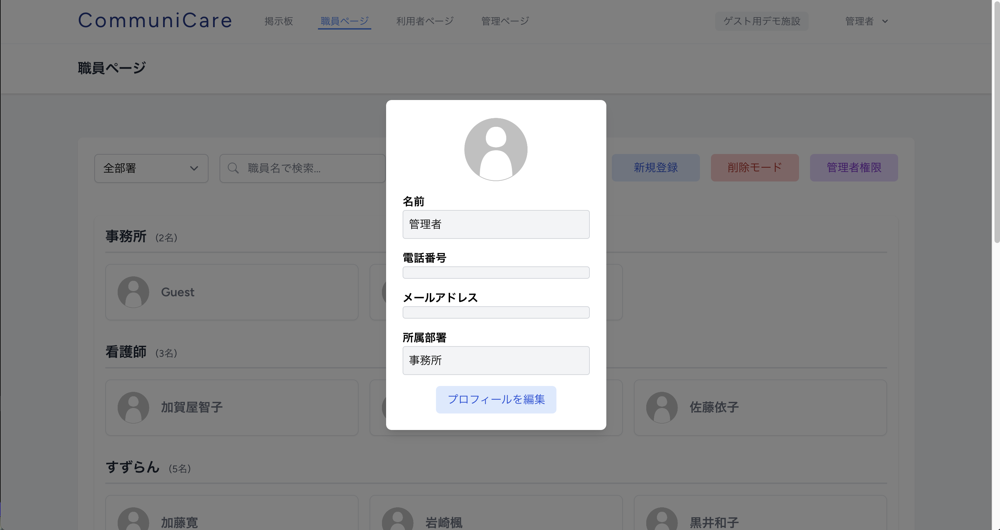

# CommuniCare

## どのようなサービスなのか？

**職員の効率的なコミュニケーションと情報管理を支援**

CommuniCare は、介護施設の運営を効率化するために、職員間のスムーズなコミュニケーションと利用者様の情報を一元管理するプラットフォームです。


---

## サービスの URL

[https://communi-care.jp](https://communi-care.jp/)

ゲストデモ機能を実装しましたので、登録せずにお試しいただけます。

-   ゲストユーザーはログアウトすると、アカウント、投稿、およびコメントが自動的に削除されます。

-   **運営側で定期的にゲストユーザーのデータを削除することがあります。** これにより、常に快適なデモ環境を提供いたします。

-   表示されている職員や利用者名はすべて **デモ用のダミーデータ** であり、実在の人物や団体とは一切関係ありません。安心してご利用ください。

-   掲示板への投稿の際は、誹謗中傷や不適切な内容の投稿はご遠慮ください。円滑なサービス運営のため、ご理解とご協力をお願いいたします。

---

## サービスを開発した背景

### **職員間の連携を強化する、タイムリーな情報共有**

介護現場では、情報共有の遅れや漏れが利用者のケアに直接影響します。この課題を解決するため、 **「誰でも直感的に使える 介護施設向けの情報共有ツール」** として CommuniCare を開発しました。

-   **課題:** 口頭での申し送りや手書きノートによる情報共有が主流で、必要な情報を得るには現場まで足を運ぶ必要がある。
-   **解決策:** どこにいても必要な情報を確認できるように、全体連絡と部署内連絡の両方に対応したツールを開発。
-   **こだわり:** 過去の重要なルールや情報を引用投稿機能で再共有することで、形骸化したルールの再確認も促進。

---

## 主な機能

### 掲示板機能

| 掲示板機能                                          |
| --------------------------------------------------- |
|  |

-   **投稿機能:** 職員が情報を共有するために投稿を作成可能。
-   **返信機能:** 各投稿に対して返信ができ、双方向のコミュニケーションを実現。
-   **引用投稿機能:** 過去の投稿を引用して新しい投稿を作成でき、情報の再共有が可能。
-   **削除機能:** 自身が作成した投稿や返信のみ削除可能。
-   **画像添付:** 投稿、引用投稿、返信に画像を添付可能。
-   **いいね機能:** 投稿に対してリアクションが可能で、いいねしたユーザーを確認できる。

| 左サイドバー                                                                                                                                   | 右サイドバー                                                                                 |
| ---------------------------------------------------------------------------------------------------------------------------------------------- | -------------------------------------------------------------------------------------------- |
|                                                                                         |                                      |
| 掲示板ごとの部署一覧が表示され、現在選択中の部署がグレーで強調される。掲示板にアクセスすると、自身の所属する部署の掲示板が自動的に表示される。 | 掲示板に関連する職員の一覧が表示され、職員名やアイコンをクリックすると詳細情報を確認できる。 |

---

### 職員ページ機能

| 職員ページ                                          | 職員詳細モーダル                                                  |
| --------------------------------------------------- | ----------------------------------------------------------------- |
|  |  |

職員の一覧を表示し、部署ごとに絞り込んで閲覧が可能。 **職員名をクリックすると、その職員の詳細情報をモーダルウィンドウで確認可能。** 管理者は職員の登録・削除が可能。

---

### 利用者ページ機能

| 利用者ページ                                              | 利用者詳細ページ                                                |
| --------------------------------------------------------- | --------------------------------------------------------------- |
|  |  |

利用者の一覧を表示し、部署ごとに絞り込んで閲覧が可能。 **利用者名をクリックすると、詳細情報ページへ移動。** サービス内容、支援状況、備考などの利用者情報の確認や編集が可能。また、管理者は利用者の登録・削除が可能。

---

### 管理ページ

| 管理ページ                                                                               | 部署管理                                                     |
| ---------------------------------------------------------------------------------------- | ------------------------------------------------------------ |
|                                  |  |
| ログイン中のユーザー情報とログイン状態を表示。管理者は部署管理（新規登録・削除）が可能。 | 部署の新規登録や削除を行うことができる管理画面。             |

---

## マルチテナンシーの採用

CommuniCare は、**介護事業所ごとの独立した情報管理を可能にするマルチテナンシー構成**を採用しています。これにより、事業所ごとの機密情報を守りつつ、安全かつ効率的にサービスを提供できます。

### **1. マルチテナンシーの方式**

-   **データベースの分離方法:** シングルデータベース＋テナント識別

-   **テナントの識別方法:** `tenant_id` カラムを用いた識別に加え、サブドメインをレンタルサーバー側に登録。

    -   ホスト側でドメインとテナントを管理することで、各事業所に専用のサブドメインを発行。
    -   発行された URL にアクセスすることで、以降は専用の管理画面からサービスを利用可能。

※当初、マルチデータベース方式を採用していましたが、レンタルサーバーの制約によりデータベースの動的作成ができないため、シングルデータベース方式に変更しました。（Docker 環境では動的なデータベース作成が可能なため、ローカル開発環境ではマルチデータベース構成のテストも実施可能です）

この仕様変更により、現在サブドメインを利用した管理環境の作成機能は**一時的に停止しています**。本来想定していた「ユーザーが自身でサブドメインを用いた独立した管理環境を作成する」という実装は、レンタルサーバーの制約により一部制限されていますが、今後の開発で改善を検討しています。


なお、**運営側で専用のテナントやサブドメインを登録することは可能**です。登録を希望される方は、**X（旧 Twitter）の DM** にてお問い合わせください。

-   X アカウント **[@shoprogramming](https://twitter.com/shoprogramming)**

### **2. マルチテナンシーを採用した目的**

-   **機密情報の保護:** 介護事業所ごとに独立したデータ管理を実現し、事業所間の情報漏洩を防止。
-   **専用の管理ページ:** 介護事業所ごとに専用の URL（ドメイン）を発行し、独自の管理ページを作成可能。

### **参考ドキュメント**

-   [Tenancy for Laravel 公式ドキュメント](https://tenancyforlaravel.com/)

### **参考記事（非公式）**

-   [Tenancy for Laravel 入門](https://zenn.dev/yudai64/articles/12aab89b6bc70e)  
    _yudai64 氏による、Tenancy for Laravel の基本概念と実装手順の解説_

### **参考動画（非公式）**

-   [01 What's Inside the Course（YouTube）](https://www.youtube.com/watch?v=hDaVMqj5D5A&list=PLoT0Ngy3KoLLomJDbNhIrQRT3n0UHVxqQ)  
    _Yin Yin Kyaw 氏によるマルチテナンシーの概要解説（非公式）_

---

### **主な使用技術**

| カテゴリ       | 技術                                   | バージョン |
| -------------- | -------------------------------------- | ---------- |
| フロントエンド | Vue.js, Inertia.js, Tailwind CSS, Vite | 3.x        |
| バックエンド   | Laravel (PHP)                          | 11.x       |
| 認証           | Laravel Breeze                         | -          |
| データベース   | MySQL                                  | 8.0.32     |
| インフラ       | Docker 27.5.1, Xserver (本番環境)      | -          |
| マルチテナント | Tenancy for Laravel (stancl/tenancy)   | 最新       |

---

## 技術選定理由

本アプリケーションの技術選定は、**「介護現場の課題解決」「開発効率の最大化」「個人の学習機会の創出」「将来的な拡張性への配慮」**の 4 つの柱に基づいて行いました。

### フロントエンド技術

#### Vue.js 3.x

既存の介護システムがネイティブアプリ中心で、Web ベースのユーザー体験が十分ではないという課題意識から、Web アプリケーションならではの **「ストレスフリーな操作感」** を実現したいと考え、SPA（Single Page Application）の導入を決定しました。

-   **直感的な学習曲線:** テンプレート構文が HTML に非常に近く直感的に理解できる点が魅力的でした。個人開発における限られたリソースで効率的な開発を実現できました。
-   **リアクティブ性を活かしたユーザー体験:** 「いいね機能」や「リアルタイムな投稿更新」など、ユーザーの操作に対して即座に UI が反応するリアクティブな挙動は、ネイティブアプリに慣れたユーザーにとっても違和感なく、快適な「ストレスフリー」体験を提供できます。
-   **日本語ドキュメントとコミュニティの充実:** 公式ドキュメントの質の高さに加え、日本語での豊富な学習リソースや活発なコミュニティが存在し、技術的な疑問を迅速に解消できます。

#### Inertia.js

Vue.js 単体での SPA 開発も検討しましたが、私がこれまで培ってきた Laravel の豊富な知見を最大限に活かしつつ、モダンな SPA 体験を提供したいという思いから Inertia.js を採用しました。

-   **Laravel 知見の最大限の活用:** Laravel のルーティング、コントローラー、バリデーション、認証といった強力な機能を、API 設計に煩わされることなく、そのまま活用できます。API レイヤーを別途設計・開発するコストを削減でき、開発効率を飛躍的に高めることができました。
-   **SPA 体験とサーバーサイド開発の融合:** 従来のサーバーサイドレンダリングのような開発パラダイムを維持しながら、ユーザーには **リッチな SPA のようなページ遷移による「ストレスフリーな操作感」** を提供できます。
-   **学習コストと SEO への配慮:** Vue.js を用いた SPA 開発にも挑戦しつつ、API 設計という新たな学習コストを抑えることができます。また、サーバーサイドで初期レンダリングが行われるため、SPA でありながら SEO への対応が比較的容易です。

#### Tailwind CSS

-   **迅速なプロトタイピング:** 個人開発ではデザイナーを立てることが難しいため、ユーティリティファーストな Tailwind CSS は、CSS 設計に悩むことなく、迅速に UI を構築できます。また、ユーティリティクラスを組み合わせることで、アプリケーション全体で一貫性のあるデザインシステムを自然と構築できます。
-   **レスポンシブ対応:** タブレットやスマートフォンでの利用を想定し、Tailwind CSS の sm:, md:などのプレフィックスを用いた直感的なレスポンシブ対応は、コードの可読性を高め、将来的なメンテナンス性にも寄与します。

### バックエンド技術

#### Laravel 11.x

Web アプリケーションフレームワークの選択において、開発の生産性と安定性、そして将来的な拡張性を考慮し、Laravel 11.x を選定しました。

-   **豊富なエコシステム:** 認証、データベース操作、ファイルアップロードなど、Web アプリケーション開発で頻繁に必要となる機能がフレームワークに標準で組み込まれており、Artisan コマンドやマイグレーション機能によって、非常に高い生産性で開発を進めることができます。
-   **マルチテナンシーへの対応:** 将来的に複数の介護事業所が独立して利用することを想定し、stancl/tenancy パッケージとの相性が良く、事業所ごとの独立したデータ管理構造を効率的に構築できます。
-   **セキュリティ機能の標準装備:** 介護施設の機密情報を扱うため、Laravel が提供する CSRF 保護や XSS 対策といった標準的なセキュリティ機能は、個人開発であっても一定のセキュリティレベルを確保できます。

#### Laravel Breeze

-   **手軽な認証機能の導入:** 複雑な権限管理を初期段階で実装するよりも、まずはセキュアで基本的な認証機能から構築し、段階的に機能拡張していく方針としました。メール認証やパスワードリセットなど、主要な認証機能を最小限の工数で導入できます。
-   **カスタマイズ性:** View 層が Laravel Blade（または Inertia.js）で書かれているためカスタマイズが容易であり、将来的に介護施設特有の職員管理要件に合わせて柔軟に調整できます。

### データベース・インフラ

#### MySQL 8.0.32

-   **実績と安定性:** 介護施設の重要なデータを扱うため、長期間にわたる運用実績と高い安定性を持つ MySQL を選択しました。また、多くのレンタルサーバーで標準的にサポートされており、運用コストを抑えつつ、既存のデータベース知識を最大限に活用できます。
-   **マルチテナンシーへの対応:** テナント分離を実現する上で必要なトランザクション制御やインデックス管理機能が充実しており、将来的にテナント数が増加した場合にも対応できる基盤です。

#### Docker

-   **開発環境の統一:** 個人開発ではありますが、将来的にチーム開発に移行する可能性を視野に入れ、開発環境の差異によるトラブルを排除することを重視しました。Docker を導入することで、「ローカルでは動くが本番で動かない」といった問題を未然に防ぎ、本番環境との整合性を高めることができます。
-   **Laravel Sail の活用:** Laravel プロジェクトに最適化された Laravel Sail を利用することで、Docker 環境のセットアップ時間を大幅に短縮し、すぐに開発に取り掛かることができます。

#### Xserver（本番環境）

-   **コストパフォーマンスとサポート体制:** スタートアップ段階の個人開発サービスにおいて、運用コストを最小限に抑えつつ、安定したサービス提供を実現できます。24 時間 365 日の日本語サポートは、万が一のトラブル発生時にも迅速な対応が期待できます。
-   **スケーラビリティの認識:** 現状では最適解ですが、将来的なユーザー数増加や機能拡張に伴い、より高度なスケーラビリティが必要になった場合には、VPS や AWS といったクラウド環境への移行を柔軟に検討できるよう、Docker ベースの環境を構築しています。

### マルチテナンシー

#### stancl/tenancy

-   **Laravel との高い親和性:** Laravel アプリケーションにマルチテナンシー機能を導入する上で、stancl/tenancy は Laravel のアーキテクチャに最適化されており、非常にスムーズに統合できます。他の汎用的なマルチテナンシーソリューションと比較して、Laravel 固有の機能を活かしつつ、少ない工数で実装できます。
-   **柔軟なデータ分離戦略:** シングルデータベース・マルチデータベースの両方に対応しているため、将来的なインフラ制約や運用方針に応じて、柔軟にデータ分離戦略を選択できます。
-   **豊富なドキュメントとコミュニティ:** ドキュメントが非常に充実しており、公式 GitHub や Stack Overflow での活発な議論も確認できるため、実装時に発生するであろう技術的課題を自力で解決できます。

### 将来性を考慮した選択

これらの技術選定は、単に現在の要件を満たすだけでなく、将来的なアプリケーションの成長と拡張を見据えています。

-   **AI 機能統合への対応:** Laravel のサービスコンテナーを活用した疎結合な設計と、Vue.js のコンポーネント指向により、将来的に AI API（例：画像認識、自然言語処理など）を統合する際にも、アプリケーション全体への影響範囲を最小限に抑え、スムーズな機能追加が可能です。
-   **モバイルアプリ展開への道筋:** Inertia.js を導入したことで、フロントエンドのロジックを Vue.js コンポーネントに集約しています。将来的にモバイルアプリ（React Native や Flutter など）を展開する際には、バックエンドの Laravel を API として再利用することで、効率的にモバイル版開発を進めることが可能です。
-   **大規模化への対応:** Docker ベースで開発・運用環境を構築したことで、アプリケーションの規模が拡大し、より高度な負荷分散やリソース管理が必要になった場合でも、Kubernetes などのコンテナオーケストレーション技術への移行が容易です。

---

## 開発環境のセットアップ

このプロジェクトをローカル環境で動作させるために、以下のツールが必要です。

-   **PHP 8.3.16**
-   **Node.js 20.18.2** (Vite のビルドに使用)
-   **Composer 2.8.5** (Laravel のパッケージ管理)
-   **Docker 27.5.1** (開発環境を構築するために Laravel Sail を利用)

---

## ディレクトリ構成

```
├── app/                 # アプリケーション本体
│   ├── Console/         # Artisanコマンド（バッチ処理）
│   ├── Http/            # コントローラー・ミドルウェア・リクエスト
│   ├── Models/          # データベースモデル
│   ├── Providers/       # サービスプロバイダ（マルチテナンシー管理含む）
├── bootstrap/           # フレームワークの起動設定
├── config/              # アプリケーションの環境設定
├── database/            # データベース関連（マイグレーション・シーダー）
├── public/              # 公開ディレクトリ（エントリーポイント）
├── resources/           # フロントエンド（Vue.js, Blade）
├── routes/              # ルーティング定義
├── storage/             # ストレージ・ログ・キャッシュ
├── tests/               # 自動テスト（Unit & Feature）
├── docker-compose.yml   # 開発環境用Docker設定
├── composer.json        # PHPパッケージ管理
├── package.json         # フロントエンド依存関係
├── vite.config.js       # フロントエンドビルド設定
```

---

## ER 図

| ER 図                                       |
| ------------------------------------------- |
|  |

## インフラ構成図


---

## 今後の展望

### 将来的に導入したい機能

-   **ファイル添付機能:** 投稿や返信に画像以外の PDF ファイルなどを添付できる機能

-   **画像複数添付:** 画像を 2 つ以上添付可能にする機能

-   **画像リサイズ機能:** アップロードした画像を適切なサイズに自動リサイズする機能

-   **通知機能:** 新しい投稿や返信に対する通知をメール、プッシュ通知、アプリ内通知の形式で受け取れる機能

-   **より詳細な利用者情報管理:** 年齢、住所、介護度など、現在よりもより詳細な情報を一元管理し、サービス向上と業務効率化を支援する機能

-   **AI 導入による機能強化:**

    -   **掲示板でのコミュニケーション解析:** AI が掲示板でのコミュニケーションを確認し、決定した入居者に対するケア内容を自動で入居者情報に書き込む機能

    -   **情報の要約:** 長文の投稿やスレッドの要点を要約して表示

    -   **タスク提案:** 過去のやり取りをもとに、必要なタスクやケアを提案

-   **マルチデータベース構成:** VPS や AWS を利用することで、レンタルサーバーの制限を超えたマルチデータベース構成を導入し、より柔軟なサービス提供を目指す

---

## 最後に

CommuniCare は、介護現場で働くすべての人が **「もっと簡単に、もっと安全に」** 仕事ができる環境を目指しています。今後も現場の声を大切に、進化を続けていきます。
