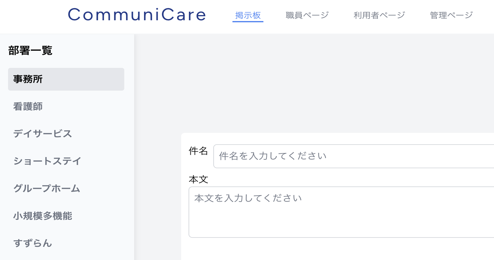

# CommuniCare

## どのようなサービスなのか？

**職員の効率的なコミュニケーションと情報管理を支援**

CommuniCare は、介護施設の運営を効率化するために、職員間のスムーズなコミュニケーションと利用者様の情報を一元管理するプラットフォームです。


---

## サービスの URL

[https://communi-care.jp](https://communi-care.jp/)

ゲストデモ機能を実装しましたので、登録せずにお試しいただけます。

-   ゲストユーザーはログアウトすると、アカウント、投稿、およびコメントが自動的に削除されます。

-   **運営側で定期的にゲストユーザーのデータを削除することがあります。** これにより、常に快適なデモ環境を提供いたします。

-   表示されている職員や利用者名はすべて **デモ用のダミーデータ** であり、実在の人物や団体とは一切関係ありません。安心してご利用ください。

-   掲示板への投稿の際は、誹謗中傷や不適切な内容の投稿はご遠慮ください。円滑なサービス運営のため、ご理解とご協力をお願いいたします。

---

## サービスを開発した背景

### **職員間の連携を強化する、タイムリーな情報共有**

介護現場では、情報共有の遅れや漏れが利用者のケアに直接影響します。この課題を解決するため、 **「誰でも直感的に使える 介護施設向けの情報共有ツール」** として CommuniCare を開発しました。

-   **課題:** 口頭での申し送りや手書きノートによる情報共有が主流で、必要な情報を得るには現場まで足を運ぶ必要がある。
-   **解決策:** どこにいても必要な情報を確認できるように、全体連絡と部署内連絡の両方に対応したツールを開発。
-   **こだわり:** 過去の重要なルールや情報を引用投稿機能で再共有することで、形骸化したルールの再確認も促進。

---

## 主な機能

### 掲示板機能

| 掲示板機能                                          |
| --------------------------------------------------- |
|  |

-   **投稿機能:** 職員が情報を共有するために投稿を作成可能。
-   **返信機能:** 各投稿に対して返信ができ、双方向のコミュニケーションを実現。
-   **引用投稿機能:** 過去の投稿を引用して新しい投稿を作成でき、情報の再共有が可能。
-   **削除機能:** 自身が作成した投稿や返信のみ削除可能。
-   **画像添付:** 投稿、引用投稿、返信に画像を添付可能。
-   **いいね機能:** 投稿に対してリアクションが可能で、いいねしたユーザーを確認できる。

| 左サイドバー                                                                                                                                   | 右サイドバー                                                                                 |
| ---------------------------------------------------------------------------------------------------------------------------------------------- | -------------------------------------------------------------------------------------------- |
|                                                                                         |                                      |
| 掲示板ごとの部署一覧が表示され、現在選択中の部署がグレーで強調される。掲示板にアクセスすると、自身の所属する部署の掲示板が自動的に表示される。 | 掲示板に関連する職員の一覧が表示され、職員名やアイコンをクリックすると詳細情報を確認できる。 |

---

### 職員ページ機能

| 職員ページ                                          | 職員詳細モーダル                                                  |
| --------------------------------------------------- | ----------------------------------------------------------------- |
|  |  |

職員の一覧を表示し、部署ごとに絞り込んで閲覧が可能。 **職員名をクリックすると、その職員の詳細情報をモーダルウィンドウで確認可能。** 管理者は職員の登録・削除が可能。

---

### 利用者ページ機能

| 利用者ページ                                              | 利用者詳細ページ                                                |
| --------------------------------------------------------- | --------------------------------------------------------------- |
|  |  |

利用者の一覧を表示し、部署ごとに絞り込んで閲覧が可能。 **利用者名をクリックすると、詳細情報ページへ移動。** サービス内容、支援状況、備考などの利用者情報の確認や編集が可能。また、管理者は利用者の登録・削除が可能。

---

### 管理ページ

| 管理ページ                                                                               | 部署管理                                                     |
| ---------------------------------------------------------------------------------------- | ------------------------------------------------------------ |
|                                  |  |
| ログイン中のユーザー情報とログイン状態を表示。管理者は部署管理（新規登録・削除）が可能。 | 部署の新規登録や削除を行うことができる管理画面。             |

---

## マルチテナンシーの採用

CommuniCare は、**介護事業所ごとの独立した情報管理を可能にするマルチテナンシー構成**を採用しています。これにより、事業所ごとの機密情報を守りつつ、安全かつ効率的にサービスを提供できます。

### **1. マルチテナンシーの方式**

-   **データベースの分離方法:** シングルデータベース＋テナント識別

-   **テナントの識別方法:** `tenant_id` カラムを用いた識別に加え、サブドメインをレンタルサーバー側に登録。

    -   ホスト側でドメインとテナントを管理することで、各事業所に専用のサブドメインを発行。
    -   発行された URL にアクセスすることで、以降は専用の管理画面からサービスを利用可能。

※当初、マルチデータベース方式を採用していましたが、レンタルサーバーの制約によりデータベースの動的作成ができないため、シングルデータベース方式に変更しました。（Docker 環境では動的なデータベース作成が可能なため、ローカル開発環境ではマルチデータベース構成のテストも実施可能です）

この仕様変更により、現在サブドメインを利用した管理環境の作成機能は**一時的に停止しています**。本来想定していた「ユーザーが自身でサブドメインを用いた独立した管理環境を作成する」という実装は、レンタルサーバーの制約により一部制限されていますが、今後の開発で改善を検討しています。


なお、**運営側で専用のテナントやサブドメインを登録することは可能**です。登録を希望される方は、**X（旧 Twitter）の DM** にてお問い合わせください。

-   X アカウント **[@shoprogramming](https://twitter.com/shoprogramming)**

### **2. マルチテナンシーを採用した目的**

-   **機密情報の保護:** 介護事業所ごとに独立したデータ管理を実現し、事業所間の情報漏洩を防止。
-   **専用の管理ページ:** 介護事業所ごとに専用の URL（ドメイン）を発行し、独自の管理ページを作成可能。

### **3. マルチテナンシーの主なメリット**

**1. 複数顧客（テナント）へのサービス提供が容易**

-   1 つのアプリケーションで、複数の介護施設や事業所などに対してサービスを提供できる。
-   新しい顧客ごとにサーバーやアプリを立ち上げる必要がないため、スケーラブルな事業展開が可能。

**2. 運用・保守コストの削減**

-   コードベースやインフラを一元管理できるため、システムの更新やバグ修正を一括で適用できる。
-   インフラコスト（サーバー・DB 等）も共有可能な設計ならコスト削減に直結。

**3. テナントごとのデータ隔離によるセキュリティ確保**

-   stancl/tenancy のようなパッケージを使えば、テナントごとにデータベースやスキーマを分離でき、セキュリティ面でも安心。
-   施設間でのデータの混在を防げるため、個人情報の管理にも適している。

**4. 将来的な SaaS 化に対応しやすい**

-   マルチテナンシー構成は、SaaS（Software as a Service）の基本。
-   ビジネスが拡大した際に、有料プラン導入や利用状況の分析などにも展開しやすい構造。

### **参考ドキュメント**

-   [Tenancy for Laravel 公式ドキュメント](https://tenancyforlaravel.com/)

### **参考記事（非公式）**

-   [Tenancy for Laravel 入門](https://zenn.dev/yudai64/articles/12aab89b6bc70e)  
    _yudai64 氏による、Tenancy for Laravel の基本概念と実装手順の解説_

### **参考動画（非公式）**

-   [01 What's Inside the Course（YouTube）](https://www.youtube.com/watch?v=hDaVMqj5D5A&list=PLoT0Ngy3KoLLomJDbNhIrQRT3n0UHVxqQ)  
    _Yin Yin Kyaw 氏によるマルチテナンシーの概要解説（非公式）_

---

### **主な使用技術**

| カテゴリ       | 技術                                   | バージョン |
| -------------- | -------------------------------------- | ---------- |
| フロントエンド | Vue.js, Inertia.js, Tailwind CSS, Vite | 3.x        |
| バックエンド   | Laravel (PHP)                          | 11.x       |
| 認証           | Laravel Breeze                         | -          |
| データベース   | MySQL                                  | 8.0.32     |
| インフラ       | Docker 27.5.1, Xserver (本番環境)      | -          |
| マルチテナント | Tenancy for Laravel (stancl/tenancy)   | 最新       |

---

## 技術選定の方針

本アプリは、以下の 4 点を重視して技術選定を行いました。

-   介護現場の課題を解決する実用性
-   限られた開発リソースでも高速に開発できる効率性
-   個人学習・技術成長の機会を最大化する柔軟性
-   将来的なスケーラビリティ・AI 統合への備え

## 技術ごとの選定理由

### フロントエンド

#### Vue.js 3

-   HTML ライクなテンプレート構文で、開発効率が高く学習しやすい。
-   Vue と Laravel の親和性が高く、Inertia.js との連携で SPA 体験を実現。
-   React と比較して、個人開発においてセットアップが簡便で日本語情報が豊富。

#### Inertia.js

-   Laravel のルーティングやバリデーション機能をそのまま活用できる。
-   REST API 不要で SPA 体験を実現しつつ、開発コストを抑制。
-   サーバーサイドレンダリングで SEO にも一定の対応が可能。

#### Tailwind CSS

-   デザインの一貫性を保ちつつ、直感的にレスポンシブ対応が可能。
-   デザイナー不在でも整った UI を迅速に構築できる。

### バックエンド

#### Laravel 11

-   認証・DB・CSRF などが標準装備されており、セキュアな業務系アプリの構築に適する。
-   stancl/tenancy との高い親和性により、介護事業所ごとのデータ分離を実現。

#### Laravel Breeze

-   認証機能の導入が簡便で、Inertia.js との統合も容易。
-   Blade or Vue での柔軟なカスタマイズが可能。

### インフラ・DB

#### MySQL 8

-   安定性と普及率の高い RDB。レンタルサーバーでも利用可能。
-   将来的なテナント数増加を想定し、運用しやすい構成を採用。

#### Docker / Laravel Sail

-   環境差異を解消し、本番と同等のローカル環境を即座に再現可能。
-   将来的なチーム開発や CI/CD への対応も想定。

#### Xserver（本番）

-   導入障壁が低く、日本語サポートが手厚い。
-   初期コストを抑えつつも安定した運用が可能。

---

## 開発環境のセットアップ

このプロジェクトをローカル環境で動作させるために、以下のツールが必要です。

-   **PHP 8.3.16**
-   **Node.js 20.18.2** (Vite のビルドに使用)
-   **Composer 2.8.5** (Laravel のパッケージ管理)
-   **Docker 27.5.1** (開発環境を構築するために Laravel Sail を利用)

---

## ディレクトリ構成

```
├── app/                 # アプリケーション本体
│   ├── Console/         # Artisanコマンド（バッチ処理）
│   ├── Http/            # コントローラー・ミドルウェア・リクエスト
│   ├── Models/          # データベースモデル
│   ├── Providers/       # サービスプロバイダ（マルチテナンシー管理含む）
├── bootstrap/           # フレームワークの起動設定
├── config/              # アプリケーションの環境設定
├── database/            # データベース関連（マイグレーション・シーダー）
├── public/              # 公開ディレクトリ（エントリーポイント）
├── resources/           # フロントエンド（Vue.js, Blade）
├── routes/              # ルーティング定義
├── storage/             # ストレージ・ログ・キャッシュ
├── tests/               # 自動テスト（Unit & Feature）
├── docker-compose.yml   # 開発環境用Docker設定
├── composer.json        # PHPパッケージ管理
├── package.json         # フロントエンド依存関係
├── vite.config.js       # フロントエンドビルド設定
```

---

## ER 図

| ER 図                                       |
| ------------------------------------------- |
|  |

## インフラ構成図


---

## 今後の展望

### 将来的に導入したい機能

-   **ファイル添付機能:** 投稿や返信に画像以外の PDF ファイルなどを添付できる機能

-   **画像複数添付:** 画像を 2 つ以上添付可能にする機能

-   **画像リサイズ機能:** アップロードした画像を適切なサイズに自動リサイズする機能

-   **通知機能:** 新しい投稿や返信に対する通知をメール、プッシュ通知、アプリ内通知の形式で受け取れる機能

-   **より詳細な利用者情報管理:** 年齢、住所、介護度など、現在よりもより詳細な情報を一元管理し、サービス向上と業務効率化を支援する機能

-   **AI 導入による機能強化:**

    -   **掲示板でのコミュニケーション解析:** AI が掲示板でのコミュニケーションを確認し、決定した入居者に対するケア内容を自動で入居者情報に書き込む機能

    -   **情報の要約:** 長文の投稿やスレッドの要点を要約して表示

    -   **タスク提案:** 過去のやり取りをもとに、必要なタスクやケアを提案

-   **マルチデータベース構成:** VPS や AWS を利用することで、レンタルサーバーの制限を超えたマルチデータベース構成を導入し、より柔軟なサービス提供を目指す

---

## 最後に

CommuniCare は、介護現場で働くすべての人が **「もっと簡単に、もっと安全に」** 仕事ができる環境を目指しています。今後も現場の声を大切に、進化を続けていきます。
